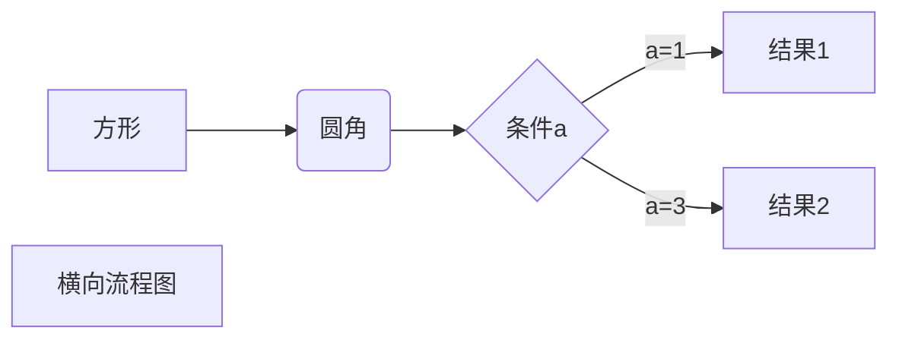
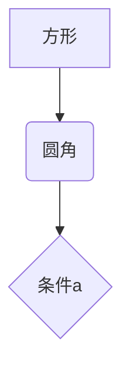
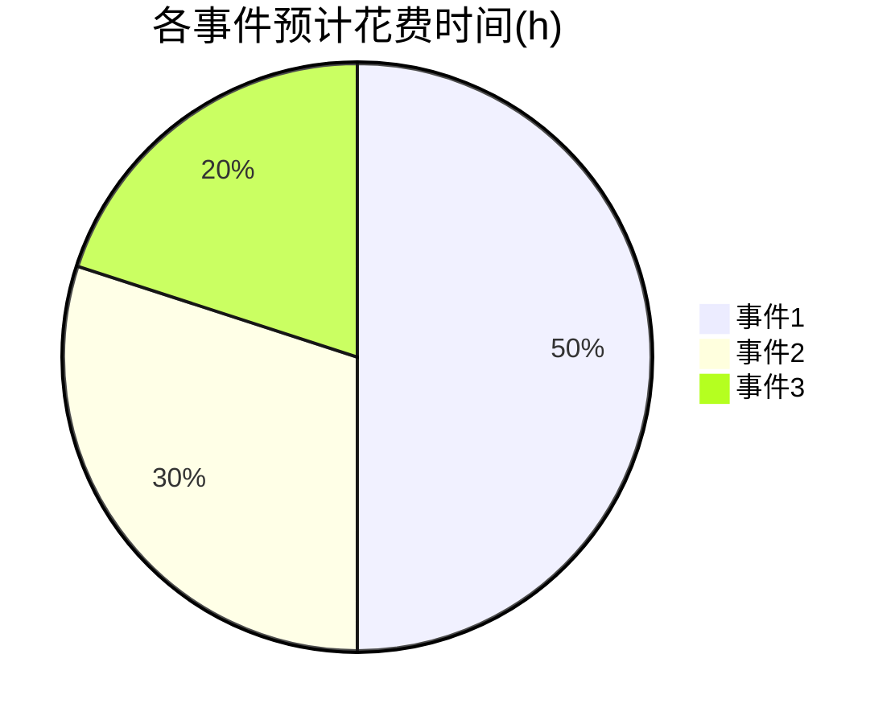
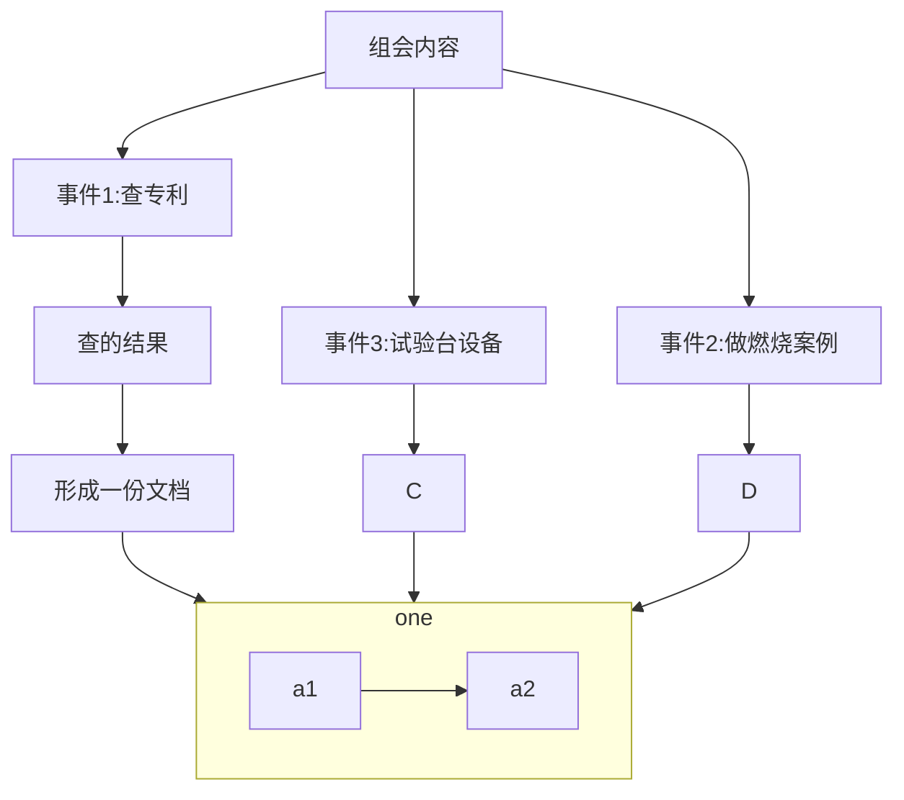

# 待办事项 写于2022.06.19

## Ⅰ：重要但不紧急

### 组会

组会内容要交流的内容💬🕟

-   [ ] **事件1**——"查专利"：民用燃具、锅炉特点与掺氢天然气燃具、锅炉特点：excel表对比；💦

-   [ ] **事件2**——"做算例"：做一个燃烧算例：不论是什么燃烧都可以；💦

-   [ ] **事件3**——"试验台"：了解一下试验台的搭建：excel表+一幅图（设备流程）；💦

### Plan

查中文专利:

 
Please press <kbd>Ctrl</kbd> + <kbd>Shift</kbd> + <kbd>R</kbd> to re-render an MDN page.

## Ⅱ：重要且紧急

## Ⅲ：不重要但紧急

## Ⅳ：不重要且不紧急

# Notes

